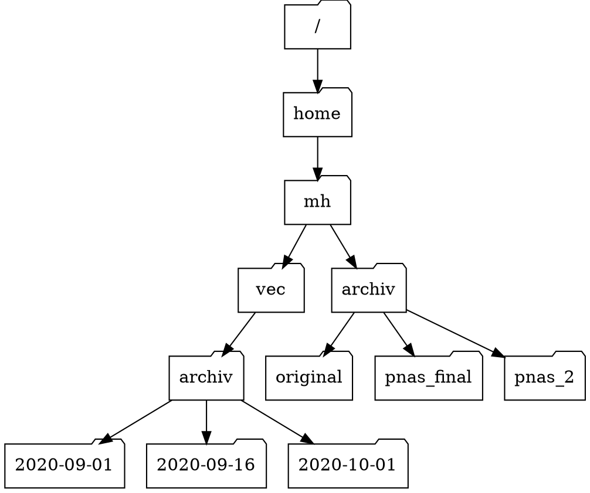

# Úkoly - Bash I

U úkolů označených ⌨* budeš potřebovat počítač.
Ostatní zkus dát „z hlavy“.

## 1. ⌨*

Co dělá příkaz `ls -v`?

* **A.** Vypíše verzi programu `ls`
* **B.** Vypíše jméno aktuálního adresáře, ne jeho obsah
* **C.** Seřadí soubory podle hodnot (víceciferných) čísel v názvech
* **D.** Vypíše obsah adresáře kompaktně – jednotlivá jména oddělí čárkou

Bonus: Jaké přepínače mají ostatní efekty?

## 2.

Začnu-li (jako uživatel `mh`) v adresáři `/home/mh/data`, které z těchto příkazů mě dostanou do `/home/mh`?

* **A.** `cd .`
* **B.** `cd /`
* **C.** `cd /home/mh`
* **D.** `cd ../..`
* **E.** `cd ~`
* **F.** `cd home`
* **G.** `cd ~/data/..`
* **H.** `cd`
* **I.** `cd ..`
* **J.**  otevření nového terminálu

## 3.

Mám-li níže ukázané adresáře, a `pwd` vypisuje `/home/mh/vec`, co ukáže `ls -F ../archiv`?

{{ figure(
    img=static('hierarchy.svg'),
    alt='Diagram adresářové struktury',
) }}

<!--



-->


* **A.** `../archiv`: Adresář nebo soubor neexistuje
* **B.** `2012-12-01 2013-01-08 2013-01-27`
* **C.** `2012-12-01/ 2013-01-08/ 2013-01-27/`
* **D.** `original pnas_final pnas_2`
* **E.** `original/ pnas_final/ pnas_2/`

## 4.

Vypadá-li disk jako v předchozím úkolu a `pwd` vypisuje `/home/mh/archiv`, které z těchto příkazů vypíšou `pnas_2/ pnas_final/ original/`?

* **A.** `ls pwd`
* **B.** `ls -r -F`
* **C.** `ls -r -F /home/mh/archiv`

## 5. ⌨*

Zadej tenhle příkaz:

```console
$ touch novy_soubor.txt
```

1. Co tenhle příkaz udělal? (Nápověda: Použij `ls`)
2. Když se do aktuálního adresáře podíváš grafickým manažerem souborů, ukáže se ti `novy_soubor.txt`?
3. Pusť `ls -l`. Zjistíš z výpisu, co nový soubor obsahuje?
4. K čemu slouží příkaz `touch`?

## 6. 

Po tom, co pustíš následující příkazy, si uvědomíš, že soubory `sucrose.dat` a `maltose.dat` jsou špatně umístěné – měly by být v adresáři `raw`.

```console
$ ls -F
 analyzed/ raw/
$ ls -F analyzed
fructose.dat glucose.dat maltose.dat sucrose.dat
$ cd analyzed
```

Doplň příkaz, který je tam přesune.

```console
$ mv sucrose.dat maltose.dat ____/____
```

## 7.

Vytvořila sis soubor `statsitika.txt`, ve kterém máš nějaké výpočty. Ale ve jméně je překlep! Které z těchto příkazů to spraví?

* **A.** `cp statsitika.txt statistika.txt`
* **B.** `mv statsitika.txt statistika.txt`
* **C.** `cp statsitika.txt .`
* **D.** `mv statsitika.txt .`


## 8.

Co vypíše `ls` na konci této sekvence příkazů?

```console
$ pwd
/home/jamie/data
$ ls
proteiny.dat
$ mkdir rekombinace
$ mv proteiny.dat rekombinace
$ cp rekombinace/proteiny.dat ../proteiny2.dat
$ ls
```


* **A.** `proteiny2.dat rekombinace`
* **B.** `rekombinace`
* **C.** `proteiny.dat rekombinace`
* **D.** `proteiny2.dat`

## 9. 

Sam má následující soubory:

```
.
├── 2015-10-23-calibration.txt
├── 2015-10-23-dataset1.txt
├── 2015-10-23-dataset2.txt
├── 2015-10-23-dataset_overview.txt
├── 2015-10-26-calibration.txt
├── 2015-10-26-dataset1.txt
├── 2015-10-26-dataset2.txt
├── 2015-10-26-dataset_overview.txt
├── 2015-11-23-calibration.txt
├── 2015-11-23-dataset1.txt
├── 2015-11-23-dataset2.txt
├── 2015-11-23-dataset_overview.txt
├── backup
│   ├── calibration
│   └── datasets
└── send_to_bob
    ├── all_datasets_created_on_a_23rd
    └── all_november_files
```

Doplň následující příkazy...

```console
$ cp *dataset* backup/datasets
$ cp ____calibration____ backup/calibration
$ cp 2015-____-____ send_to_bob/all_november_files/
$ cp ____ send_to_bob/all_datasets_created_on_a_23rd/
```

... aby výsledek vypadal takhle:

```
.
├── 2015-10-23-calibration.txt
├── 2015-10-23-dataset1.txt
├── 2015-10-23-dataset2.txt
├── 2015-10-23-dataset_overview.txt
├── 2015-10-26-calibration.txt
├── 2015-10-26-dataset1.txt
├── 2015-10-26-dataset2.txt
├── 2015-10-26-dataset_overview.txt
├── 2015-11-23-calibration.txt
├── 2015-11-23-dataset1.txt
├── 2015-11-23-dataset2.txt
├── 2015-11-23-dataset_overview.txt
├── backup
│   ├── calibration
│   │   ├── 2015-10-23-calibration.txt
│   │   ├── 2015-10-26-calibration.txt
│   │   └── 2015-11-23-calibration.txt
│   └── datasets
│       ├── 2015-10-23-dataset1.txt
│       ├── 2015-10-23-dataset2.txt
│       ├── 2015-10-23-dataset_overview.txt
│       ├── 2015-10-26-dataset1.txt
│       ├── 2015-10-26-dataset2.txt
│       ├── 2015-10-26-dataset_overview.txt
│       ├── 2015-11-23-dataset1.txt
│       ├── 2015-11-23-dataset2.txt
│       └── 2015-11-23-dataset_overview.txt
└── send_to_bob
    ├── all_datasets_created_on_a_23rd
    │   ├── 2015-10-23-dataset1.txt
    │   ├── 2015-10-23-dataset2.txt
    │   ├── 2015-10-23-dataset_overview.txt
    │   ├── 2015-11-23-dataset1.txt
    │   ├── 2015-11-23-dataset2.txt
    │   └── 2015-11-23-dataset_overview.txt
    └── all_november_files
        ├── 2015-11-23-calibration.txt
        ├── 2015-11-23-dataset1.txt
        ├── 2015-11-23-dataset2.txt
        └── 2015-11-23-dataset_overview.txt
```

## 10.

Máš následující soubory:

```console
$ ls -F
analyzed/  fructose.dat    raw/   sucrose.dat
```

Zkus napsat co nejkratší příkaz, kterým přesuneš `fructose.dat` a `sucrose.dat` do adresáře `analyzed/`.

## 11.

Které z následujících sad příkazů vytvoří tuhle strukturu adresářů?

```plain
2016-05-20/
└── data
    ├── processed
    └── raw
```

**A.**
```console
$ mkdir 2016-05-20
$ mkdir 2016-05-20/data
$ mkdir 2016-05-20/data/processed
$ mkdir 2016-05-20/data/raw
```

**B.**
```console
$ mkdir 2016-05-20
$ cd 2016-05-20
$ mkdir data
$ cd data
$ mkdir raw processed
```

**C.**
```console
$ mkdir 2016-05-20/data/raw
$ mkdir 2016-05-20/data/processed
```

**D.**
```console
$ mkdir -p 2016-05-20/data/raw
$ mkdir -p 2016-05-20/data/processed
```

**E.**
```console
$ mkdir 2016-05-20
$ cd 2016-05-20
$ mkdir data
$ mkdir raw processed
```

